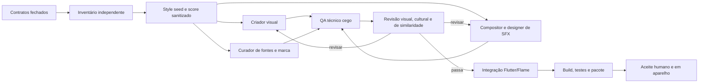

# Aura Shift: Six Seven — Pipeline Multiagente de Assets

> Contrato `asset-pipeline-v1`. Esta pipeline produz candidatos completos e
> reproduzíveis; `candidate-reviewed` não significa aprovação humana, jurídica
> ou em aparelho físico.

## Objetivo e fronteiras

Produzir, revisar, integrar e rastrear toda a superfície de assets do MVP:

- arte modular da cena Flame, Aparências, Formas, fundos, Ramos, VFX, Selos,
  eventos e Conquistas;
- ícones funcionais, fontes, marca, launcher, splash e materiais-base de loja;
- sete faixas musicais selecionadas, doze sons Six/Seven, treze sons de
  UI/Loja/Coleção e dez sons de evento;
- manifestos, hashes, fontes editáveis, proveniência e relatórios de QA.

Haptics continuam código/configuração e não arquivos. Screenshots finais da
Google Play dependem de build localizado executado em aparelho/emulador e não
são simulados como se fossem capturas reais.

## Organização dos agentes

Cada lote usa papéis separados. Um agente não aprova o próprio trabalho.

| Papel | Entrada | Saída | Pode alterar |
| --- | --- | --- | --- |
| Orquestrador | contratos e estado do repo | plano, lotes e decisão consolidada | integração, manifests e docs da pipeline |
| Inventarista | código + contratos | inventário fechado e gaps | nada; somente leitura |
| Diretor de Arte | `art-v1`, catálogo e UI | style seed, paleta, envelopes e prompts sanitizados | relatório/direção do lote |
| Compositor Isolado | apenas briefing sanitizado | score procedural e stems candidatos | `sources/audio/procedural`, masters e runtime |
| Importador da Trilha | sete WAVs selecionados + hashes esperados | fontes preservadas, masters normalizados e Ogg v2 | `sources/audio/imported`, masters/runtime v2 |
| Designer de SFX | funções/durações, sem referência externa | famílias Six/Seven, UI e eventos | fontes/masters/runtime de SFX |
| Curador de Fontes | famílias exigidas e fontes oficiais | binários pinados, licenças e hashes | `assets/fonts`, manifesto de fontes |
| Criador Visual | style seed + IDs/pivôs | SVGs editáveis e WebP/PNG derivados | `sources/art`, `assets/art` |
| Revisor Técnico | candidatos sem justificativa do criador | dimensões, codecs, alpha, pico, loop, hashes | apenas relatórios |
| Revisor Visual/Cultural | folhas de contato e regras duras | legibilidade, consistência e semelhança indevida | apenas relatório de achados |
| Auditor de Áudio | métricas + escuta humana futura | fadiga, mono, similaridade e direitos | apenas decisão/rejeição |
| Integrador | somente lotes que passaram QA automático | loaders, `pubspec`, app icon e manifestos | código/configuração |
| Verificador | build integrado | testes, AAB, inventário empacotado | apenas evidência/correções aprovadas |

O Compositor Isolado nunca recebe faixa, artista, gravação ou análise que possa
reconstruir uma obra. O auditor de similaridade pode rejeitar um candidato,
mas devolve apenas riscos abstratos; não devolve elementos copiáveis.

## Fluxo de produção



Estados permitidos nesta automação:

`specified → generated → technical-review → candidate-reviewed → integrated-candidate`

Somente uma decisão humana posterior pode promover um lote para `approved`.
Qualquer revisão muda o conteúdo, incrementa `revision` e recalcula hashes.

### Promoção executada

A decisão explícita de 10 de julho de 2026 está em
`assets/manifests/asset-approval-v1.json`. O comando
`python3 tools/assets/promote_approved_assets.py` preserva os manifests
candidatos, verifica escopo/estado/revisão e deriva os contratos aprovados de
arte e áudio mais `production-assets-v1.json`. A incorporação ao código promove
o lote para `integrated`; validações físicas continuam como pendências explícitas
e não alteram os hashes aprovados.

A substituição musical possui decisão própria, datada de 12 de julho de 2026,
em `assets/manifests/music-selection-approval-v1.json`. Ela deriva
`audio-manifest-v2.json` sem alterar o snapshot procedural v1.

## Lotes e gates

### Lote A — style seed

- Mascote base, mãos Six/Seven e cinco expressões;
- um item Poise, Motion e Signal;
- fundo base, `FORM-01`, `FORM-05`, VFX essenciais e Selo 67;
- `Boss Shift`, uma faixa sucessora para provar crossfade, duas variações
  Six/Seven, três UI e um stinger;
- app icon, splash e fontes.

Gate: silhueta a 10%, monocromia, pivôs, loop, mono, picos e identidade das
três famílias. O lote integral só usa regras consolidadas por esse seed.

### Lote B — produção integral

- todas as variantes físicas previstas no `art-manifest-v1`;
- 42 masters obrigatórios: sete músicas e 35 SFX, sem condicionais;
- 13 badges de Conquista e ícones funcionais;
- proveniência e relatórios por arquivo.

Gate: contagem exata, nenhum placeholder/hash nulo, formatos corretos, orçamento
por arquivo, ausência de duplicatas acidentais e revisão independente.

### Lote C — integração

- `pubspec.yaml`, fontes por locale e carregadores;
- cena Flame com fundo, rig, todas as skins ativas, Forma e VFX reais;
- áudio governado por eventos de domínio, nunca pelo timing econômico;
- launcher/splash e inventário incluído no AAB.

Gate: `flutter analyze`, testes, build e inspeção do pacote.

### Lote D — aparelho e publicação

- máscara do adaptive icon e splash em aparelhos reais;
- latência, playlist/crossfade, foco/retomada e fadiga;
- capturas localizadas reais e materiais da Google Play;
- escuta humana, auditoria de similaridade e aceite final.

Gate: nenhuma promoção automática. Evidência real e decisão humana obrigatórias.

## Comandos reproduzíveis

O ambiente de áudio é isolado porque requer bibliotecas numéricas e codec:

```bash
python3 -m venv .asset-venv
.asset-venv/bin/python -m pip install -r tools/assets/requirements-audio.txt
.asset-venv/bin/python -m pip install -r tools/assets/requirements-visual.txt

python3 tools/assets/fetch_fonts.py
.asset-venv/bin/python tools/assets/generate_brand_assets.py
python3 tools/assets/generate_art_assets.py
python3 tools/assets/validate_art_assets.py --determinism
.asset-venv/bin/python tools/assets/generate_audio_assets.py  # snapshot procedural v1
.asset-venv/bin/python tools/assets/review_audio_assets.py    # snapshot procedural v1
.asset-venv/bin/python tools/assets/import_selected_music.py
# --source-dir só é necessário para reimportar outro diretório verificado
.asset-venv/bin/python tools/assets/build_audio_listening_sheet.py
.asset-venv/bin/python tools/assets/review_brand_and_fonts.py
python3 tools/assets/build_production_index.py  # snapshot integrado v1

flutter clean
flutter pub get
dart format lib test
flutter analyze
flutter test
flutter build apk --debug
python3 tools/assets/verify_packaged_assets.py
```

Quando o Android SDK e as credenciais existirem:

```bash
flutter build appbundle --release
unzip -l build/app/outputs/bundle/release/app-release.aab \
  | rg 'assets/(art|audio|brand|fonts|manifests)|ic_launcher'
```

## Rubricas de revisão

### Arte

- IDs, dimensões, pivôs, z-layer, alpha e hashes válidos;
- Mascote/mãos legíveis a 10% e expressões distinguíveis;
- Poise, Motion e Signal distinguíveis por forma sem cor;
- olhos e mãos não ocluídos; slot e safe area respeitados;
- reduced derivado do mesmo master;
- zero texto essencial, logo, marca, recompensa monetária ou gesto cultural;
- asset individual abaixo de 1 MiB, salvo exceção registrada;
- folha de contato em cor, escala de cinza e miniatura.

### Áudio

- masters WAV PCM 48 kHz/24-bit, música runtime Ogg 48 kHz e SFX runtime WAV
  PCM16 48 kHz;
- sete músicas completas `non-loop`, `Boss Shift` primeiro e frame count preservado no Ogg;
- arquivos finitos, sem clipping/DC bloqueador e com hashes válidos;
- música próxima de `-16 LUFS-I`; stingers entre `-18` e `-14`; SFX com
  sample peak até `-3 dBFS`;
- Six prepara e Seven resolve; seis variações sem repetição imediata;
- fonte externa/IA declarada com hash e cadeia de conversão, sem inventar prompt ou licença;
- posição, conclusão, crossfade e callbacks antigos avaliados no runtime;
- termos, latência, fadiga e semelhança ficam pendentes até teste humano/aparelho.

### Marca e fontes

- launcher legível a 48 px e dentro da zona segura do adaptive icon;
- variante monocromática e splash sem fundo branco acidental;
- feature graphic sem texto rasterizado e com safe area;
- fontes não modificadas, commits pinados, licença e SHA-256 presentes;
- shaping árabe, japonês, reflow e escala de 200% testados no app real.

## Evidência e honestidade de status

Todo relatório declara o que foi automatizado e o que não foi observado. Em
especial, análise numérica não substitui audição; folhas de contato não
substituem teste de animação; e agentes não substituem parecer jurídico. Um
manifesto candidato nunca usa `approved` nem omite pendências de aparelho.

O prompt e o caminho do key art gerado pelo recurso de imagem ficam registrados
em `provenance/art/key-art-imagegen-v1.md`; os sprites de runtime são reconstruções
vetoriais determinísticas, não recortes desse raster.
