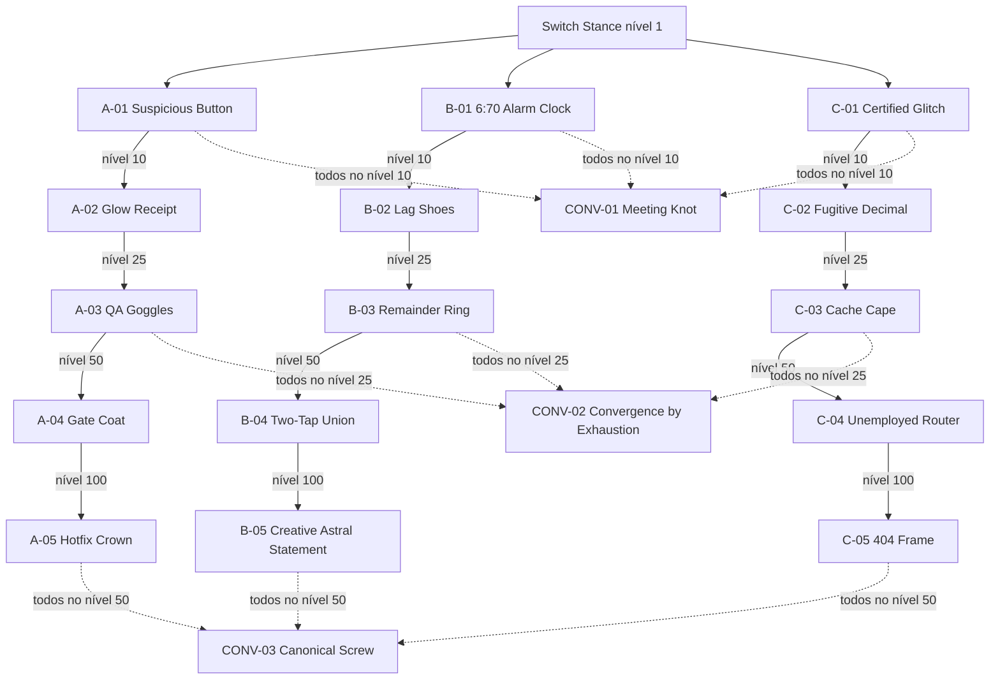

# Aura Shift: Six Seven — Topologia da Árvore de Aura

> Status: grafo, Pré-requisitos e Patamares preservados em `balance-v0.3`; composição visual única com Técnicas integrada em 12 de julho de 2026.

## Visão geral

A Árvore de Aura é uma única superfície visual da Loja. As seis Técnicas Six-Seven formam seu tronco central por Patamar; ao redor dele permanecem exatamente três ramos simétricos de cinco Itens de Aura e três Itens de Convergência opcionais. A integração das Técnicas é somente visual: elas não se tornam Itens de Aura, não constituem um quarto Ramo de Aura e não recebem novas dependências econômicas.

No MVP, a simetria também é econômica: itens A, B e C de mesma profundidade possuem parâmetros idênticos. Tema e aparência diferenciam a experiência colecionável, mas não criam um ramo numericamente superior. Somente as Convergências possuem parâmetros próprios fora desse espelho.

Os territórios finais são **Poise** (A), **Motion** (B) e **Signal** (C). Eles descrevem apenas identidade, aparência e áudio; não são classes, afinidades ou multiplicadores. As Convergências formam o território **Spectrum** e continuam opcionais.

## Composição visual por Patamar

| Faixa visual | Tronco central | Ramos de Aura na faixa | Convergência na faixa |
| --- | --- | --- | --- |
| inicial | `TECH-01` | `A/B/C-01` | — |
| `1K` Aura Total | `TECH-02` | `A/B/C-02` | `ITEM-CONV-01` |
| `1M` Aura Total | `TECH-03` | `A/B/C-03` | — |
| `1B` Aura Total | `TECH-04` | `A/B/C-04` | `ITEM-CONV-02` |
| `1T` Aura Total | `TECH-05` | `A/B/C-05` | — |
| `1Qa` Aura Total | `TECH-06` | — | `ITEM-CONV-03` |

Essa tabela determina agrupamento e posição dos seis nós de Técnica e 18 nós de Item de Aura, não arestas do grafo econômico. Transformações de Aura e Ascensão permanecem marcos externos e não são nós nem conteúdo da superfície. Faixas, halos e fundos podem mostrar que os nós compartilham um limiar de Aura Total. Conectores são reservados a Pré-requisitos reais; portanto não existem linhas de dependência entre `TECH-01` a `TECH-06` nem entre uma Técnica e os outros conteúdos do mesmo Patamar. A única relação de Técnica que participa do grafo abaixo continua sendo a regra já existente: `TECH-01` no nível `1` libera os três Itens-raiz.

O diagrama seguinte registra somente Pré-requisitos econômicos reais. O eixo visual completo das Técnicas é regido pela tabela acima e não acrescenta setas ao grafo.

Todas as setas de uma Convergência são conjuntivas. Além das dependências mostradas, cada nó exige o Patamar de Aura correspondente.

## Regras dos ramos

| Nó | Custo-base | Contribuição-base por nível | Pré-requisito de Item | Patamar |
| --- | ---: | ---: | --- | --- |
| `A/B/C-01` | `270` | `0,75 Aura/s` | `TECH-01` no nível `1` | acesso inicial, sem limiar adicional |
| `A/B/C-02` | `2.350` | `6,7 Aura/s` | respectivo `01` no nível `10` | `1K` Aura Total |
| `A/B/C-03` | `67.000` | `67 Aura/s` | respectivo `02` no nível `25` | `1M` Aura Total |
| `A/B/C-04` | `67.000` | `6.700 Aura/s` | respectivo `03` no nível `50` | `1B` Aura Total |
| `A/B/C-05` | `67.000.000.000` | `67.000.000 Aura/s` | respectivo `04` no nível `100` | `1T` Aura Total |

Atender o nível sem possuir o Patamar mantém o item bloqueado. Possuir o Patamar sem atender o nível também mantém o item bloqueado. A interface deve mostrar separadamente qual condição falta.

Os Orçamentos de Gate exatos do predecessor são `5.487`, `500.078`, `483.587.018` e `524.526.228.030 Aura`, respectivamente. Para a última transição do gate de nível `100`, `99→100` custa `68.416.522.780`; `100→101`, que já ocorre depois do gate, custa `78.679.001.197`. Essa distinção deve existir nas fixtures para impedir um erro de índice.

## Regras das Convergências

| Item | Requisitos simultâneos | Custo-base | Contribuição-base por nível | Papel |
| --- | --- | ---: | ---: | --- |
| `ITEM-CONV-01` | `A-01`, `B-01`, `C-01` no nível `10` e `1K` Aura Total | `6.700 Aura` | `7,5 Aura/s` | recompensa de amplitude inicial |
| `ITEM-CONV-02` | `A-03`, `B-03`, `C-03` no nível `25` e `1B` Aura Total | `26.800.000 Aura` | `3.350 Aura/s` | recompensa de amplitude intermediária |
| `ITEM-CONV-03` | `A-05`, `B-05`, `C-05` no nível `50` e `1Qa` Aura Total | `670.000.000.000.000 Aura` | `13.400.000.000 Aura/s` | objetivo amplo tardio |

Os respectivos Orçamentos de Amplitude são `16.461`, `44.288.124` e `1.452.336.002.684.412 Aura`. O primeiro nível de cada Convergência acrescenta `1/6` da produção somada dos três nós diretamente exigidos. O custo adicional permanece fora desse orçamento e precisa ser pago normalmente.

Convergências:

- possuem aquisição e níveis como outros Itens de Aura;
- aumentam Produção Passiva;
- não desbloqueiam nós de ramo;
- não liberam Patamares;
- não são condição de Ascensão;
- são reiniciadas pela Ascensão;
- podem ser ignoradas por uma estratégia especialista.

## Ascensão

Na Ascensão, aquisições e níveis retornam ao estado inicial, portanto todos os Pré-requisitos precisam ser reconstruídos. Os Patamares já liberados por Aura Total permanecem abertos. O Multiplicador de Ascensão torna a reconstrução progressivamente mais rápida sem entregar automaticamente os itens.

## Estados de interface

Cada nó de Técnica deve distinguir Patamar ainda fechado de Aura Disponível insuficiente. Uma Técnica liberada por Aura Total é comprável sujeita somente ao próprio custo; nenhuma Técnica mostra outra Técnica, Item ou Convergência como requisito.

Cada nó de Item bloqueado deve distinguir:

- Patamar de Aura ainda fechado;
- item predecessor ainda não adquirido;
- nível do predecessor insuficiente;
- múltiplos requisitos de Convergência parcialmente atendidos.

Convergências devem mostrar o progresso de cada um dos três requisitos, sem uma porcentagem que esconda qual ramo falta.

## Cenários obrigatórios de simulação

1. especialista em A, B ou C;
2. investimento dividido em dois ramos;
3. investimento amplo buscando `CONV-01`;
4. investimento amplo buscando `CONV-02`;
5. investimento amplo tardio buscando `CONV-03`;
6. reconstrução de cada rota após a primeira Ascensão;
7. Compra em Lote que satisfaz um ou vários Pré-requisitos.

Especialista A, B e C devem produzir saídas idênticas sob o mesmo Perfil de Simulação e heurística. Qualquer diferença é defeito, não variação aceita.

## Identidade e apresentação fechadas

- `TECH-01` a `TECH-06` ocupam o tronco central da composição, em ordem de Patamar, mas sem conectores entre si. Cada Técnica usa marcador ordinal próprio e mantém Potência de Ciclo como efeito.
- Poise ocupa a trilha esquerda, Motion a central e Signal a direita no LTR. As Técnicas intercalam o eixo central em estágios próprios; compartilhar o alinhamento com Motion não cria conexão ou Pré-requisito. Em RTL, a composição espelha visualmente, mas IDs, requisitos e ordem semântica Poise, Motion, Signal permanecem estáveis.
- Poise, Motion e Signal são os únicos Ramos de Aura. O tronco de Técnicas e Spectrum não são ramos.
- Convergências ficam no eixo entre as três colunas e exibem individualmente os três requisitos, nunca uma porcentagem agregada.
- Em desbloqueios simultâneos: persistir todos; destacar primeiro o nó de ramo de menor profundidade e depois a Convergência; empates seguem ordem estável A, B, C e Convergência. A ordem não implica recomendação econômica.
- Nomes e aparências completos estão em `CONTENT-CATALOG.md`; nenhum label localizado substitui o ID em save, analytics ou fixtures.
