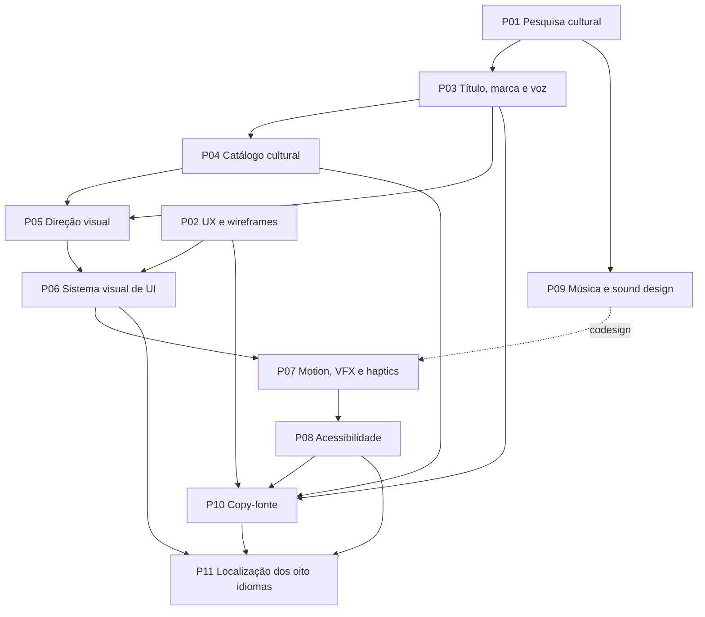

# Aura Shift: Six Seven — Roadmap do Planejamento ao Desenvolvimento

> Status em 10 de julho de 2026: execução documental P01–P11 concluída e auditada em `planning-v1`; estado **APPROVED** pelo usuário. Produção/aprovação de assets visuais e masters sonoros continua explicitamente fora de conclusão e pertence ao desenvolvimento.

## Resultado da execução `planning-v1`

| Rodada | Estado | Evidência principal |
| --- | --- | --- |
| P01 | PASS | `CULTURAL-RESEARCH-DOSSIER.md` |
| P02 | PASS | `UX-WIREFRAMES.md` |
| P03 | APPROVED | `BRAND-VOICE-GUIDE.md`, `USER-APPROVAL-PACKET.md` |
| P04 | PASS — 42/42 slots | `CONTENT-CATALOG.md`, `ACHIEVEMENTS.md` |
| P05 | especificação completa; assets reais pendentes | `ART-DIRECTION.md`, `ASSET-MANIFEST.md` |
| P06 | PASS | `UI-DESIGN-SYSTEM.md` |
| P07 | PASS | `MOTION-VFX-BIBLE.md` |
| P08 | PASS documental; build deverá comprovar | `ACCESSIBILITY.md` |
| P09 | especificação completa; 40 masters reais pendentes | `AUDIO-DIRECTION.md`, `AUDIO-INVENTORY.md` |
| P10 | PASS | `COPY-DECK.md` |
| P11 | PASS documental — 8×261 strings | `LOCALIZATION-GLOSSARY.md`, `localization/` |

A auditoria, correções cruzadas, comando de validação, limites e blockers honestos estão em `PLANNING-AUDIT.md`. O aceite do usuário está registrado em `USER-APPROVAL-PACKET.md`.

## Fronteira deste roadmap

A arquitetura-base, as regras econômicas e o planejamento técnico fundamental já estão documentados. Sua execução, validação e evolução ocorrerão durante o desenvolvimento do aplicativo e não são repetidas neste roteiro.

Originalidade, propriedade intelectual, adequação etária e proveniência também já possuem regras aprovadas. Elas permanecem como critérios obrigatórios dentro das rodadas Cultural, Visual e Sonora, mas não constituem uma rodada separada.

Uma rodada termina quando:

1. seus entregáveis estão registrados no repositório;
2. uma revisão independente por outro agente foi concluída;
3. divergências e riscos foram consolidados;
4. os documentos afetados foram atualizados;
5. o usuário aprovou as decisões de identidade e experiência.

## UX, UI e arte são frentes diferentes

- **UX:** fluxos, hierarquia, compreensão, estados, erros e retomadas.
- **UI visual:** componentes, tipografia, espaçamento, iconografia e apresentação das informações.
- **Direção de arte:** Mascote, paletas, Aura, fundos, Aparências e Transformações.

Assim, paletas de cores pertencem principalmente às rodadas de Arte e UI. A rodada de UX verifica se ações, informações e feedbacks continuam compreensíveis.

## Sequência recomendada

P01 e P02 podem começar imediatamente em paralelo. As demais rodadas seguem as dependências abaixo, sem exigir um waterfall rígido.

## Onda 1 — começar agora

### P01 — Pesquisa cultural e inteligência de memes

- **Objetivo:** mapear o uso atual de Six-Seven, farmar Aura, mewing, memes adjacentes e referências brasileiras ou pernambucanas.
- **Entregáveis:** dossiê datado, contexto de uso, referências vivas e saturadas, territórios culturais para os três Ramos, oportunidades de transcriação e riscos ligados a pessoas, marcas e obras.
- **Critério de saída:** existe repertório suficiente para nomear os 42 slots sem depender de gírias forçadas, interpretações de “tiozão” ou referências de risco alto.
- **Dependências:** nenhuma; é a prioridade criativa imediata.
- **Documentos:** `CONTENT-DESIGN-PLAN.md`, `LOCALIZATION-PLAN.md` e novo dossiê cultural.

### P02 — Arquitetura de UX, fluxos e wireframes

- **Objetivo:** fechar como todas as regras já definidas serão apresentadas e operadas.
- **Entregáveis:** mapa das quatro áreas — Jogar, Loja, Coleção e Ajustes —, incluindo a Árvore dentro da Loja, além de wireframes e estados para tutorial, retorno offline, anúncios, Ascensão, backup, consentimentos, diagnóstico, erros e retomadas.
- **Critério de saída:** caminhos felizes, bloqueios, falhas, cancelamentos e reaberturas possuem comportamento documentado e utilizável com uma mão.
- **Dependências:** pode avançar com IDs neutros enquanto P01 acontece.
- **Documentos:** `UX-DESIGN.md`, `ONBOARDING.md` e documentos dos fluxos integrados.

## Onda 2 — identidade e catálogo

### P03 — Título, marca e voz

- **Objetivo:** substituir o título provisório e definir a personalidade verbal do produto.
- **Entregáveis:** shortlist, título recomendado, alternativas de reserva, tagline, promessa da marca, pilares de voz, regras de nomenclatura e vocabulário evitado.
- **Critério de saída:** título e voz são reconhecíveis, coerentes com a Janela do Meme e utilizáveis nos oito idiomas.
- **Dependências:** P01.
- **Documentos:** `GAME-CONCEPT.md`, `PRODUCT-STRATEGY.md` e novo guia de marca e voz.

### P04 — Catálogo cultural e conteúdo final

- **Objetivo:** transformar todos os IDs neutros em conteúdo real, mantendo o espelhamento econômico aprovado.
- **Entregáveis:** identidades dos três Ramos; nomes, descrições, conceitos e Aparências dos 18 Itens; seis Técnicas; cinco Transformações; 13 Conquistas e seus gatilhos; feedbacks dos Marcos 67; dependências de arte, áudio e localização.
- **Critério de saída:** nenhum campo `A definir` permanece; todos os 42 slots possuem função e identidade claras; A/B/C continuam numericamente equivalentes em cada profundidade.
- **Dependências:** P01 e P03.
- **Documentos:** `CONTENT-CATALOG.md`, `ACHIEVEMENTS.md`, `AURA-TREE-DESIGN.md`.

## Onda 3 — identidade visual e sensorial

### P05 — Direção visual, Mascote e bíblia de assets

- **Objetivo:** fechar uma identidade original, marcante e produzível com o pseudo-rig já planejado.
- **Entregáveis:** linguagem gráfica, referências permitidas e proibidas, paleta-base, progressão cromática, character sheet, mãos, identidade dos Ramos, cinco concept sheets de Transformação, Aura, fundos, Selos 67, slots de Aparência, pivôs, camadas, formatos, dimensões e inventário de assets.
- **Critério de saída:** o estilo está aprovado; Mascote e Transformações são reconhecíveis; cada asset possui especificação de produção e alternativa reduzida quando aplicável.
- **Dependências:** P01, P03 e os territórios de conteúdo de P04.
- **Documentos:** `ART-DIRECTION.md`, `CONTENT-CATALOG.md` e novo manifesto de assets.

### P06 — Sistema visual de UI

- **Objetivo:** transformar UX e arte em telas e componentes consistentes.
- **Entregáveis:** paleta funcional, tipografia, espaçamento, iconografia, componentes, estados, navegação, números extremos e telas-chave em alta fidelidade.
- **Critério de saída:** os componentes cobrem todos os estados documentados e funcionam com texto expandido, RTL, escala textual e `number-format-v1`.
- **Dependências:** P02 e P05. P06 fornece os componentes que P11 localizará e recebe de volta ajustes tipográficos sem depender da conclusão integral daquela rodada.
- **Documentos:** `UX-DESIGN.md`, `ART-DIRECTION.md` e novo design system.

### P07 — Motion design, VFX e haptics

- **Objetivo:** especificar o ritmo visual e tátil do Ciclo Six-Seven e das recompensas.
- **Entregáveis:** timings e storyboards de Six/Seven, curva de intensidade, partículas, feedback de toque, compras, Transformações, Conquistas, Ascensão, Marco 67, prioridades e interrupções.
- **Critério de saída:** cada efeito possui entrada, duração, saída e versão reduzida; nenhum feedback sugere combo ou ganho econômico inexistente.
- **Dependências:** P02, P05, P06 e codesign com P09.
- **Documentos:** `ART-DIRECTION.md`, `UX-DESIGN.md`, `ACCESSIBILITY.md` e nova bíblia de motion/VFX.

### P08 — Acessibilidade mensurável

- **Objetivo:** converter princípios existentes em critérios objetivos para UI, arte, motion, áudio e localização.
- **Entregáveis:** contraste, limites de flash/partículas/movimento, escala textual, alvos de toque, foco, TalkBack, redundância sensorial e comportamento dos modos reduzidos.
- **Critério de saída:** cada requisito possui limiar ou roteiro verificável para os oito idiomas, árabe RTL, números extremos e canais sensoriais desativados.
- **Dependências:** primeiras versões de P02, P06, P07 e P09.
- **Documentos:** `ACCESSIBILITY.md`, `UX-DESIGN.md`, `REQUIREMENTS.md`.

### P09 — Música, sound design, SFX e proveniência

- **Objetivo:** criar um pacote sonoro instrumental, original, repetível e pronto para integração.
- **Entregáveis:** briefing sanitizado; instrumentação; paleta sonora; loop principal em camadas base, groove e hype; versões de menu; quatro a seis variações Six/Seven; sons de Loja, Transformações, Ascensão e Marco 67; padrões táteis; ferramenta, licença e registro de proveniência.
- **Critério de saída:** arquivos e masters estão organizados, licenciados e aprovados na auditoria de similaridade; loops, variações e limites de fadiga estão documentados.
- **Dependências:** P01, P03, P05 e codesign com P07.
- **Documentos:** `AUDIO-DIRECTION.md` e novo inventário de áudio.

## Onda 4 — texto e idiomas

### P10 — Copy-fonte, onboarding e microcopy

- **Objetivo:** produzir todo o texto canônico em `en-US`.
- **Entregáveis:** inventário de strings com IDs e contexto para tutorial, catálogo, Loja, bloqueios, Ascensão, retorno, anúncios, backup, erros, consentimentos, diagnóstico, configurações, acessibilidade e mensagens de sistema.
- **Critério de saída:** todos os estados documentados possuem texto; placeholders, plurais e variantes curtas estão definidos; nenhum texto essencial existe apenas em imagem.
- **Dependências:** P02, P03, P04 e P08.
- **Documentos:** `ONBOARDING.md`, `UX-DESIGN.md`, documentos de conteúdo e novo copy deck.

### P11 — Internacionalização, tradução e transcriação dos oito idiomas

- **Objetivo:** fechar a operação multilíngue antes da integração das strings no aplicativo.
- **Entregáveis:** fontes e fallbacks licenciados, esquema de mensagens, glossário, memória de tradução, plurais, placeholders, bidi, pseudo-localização e versões de `en-US`, `pt-BR`, `es-419`, `fr-FR`, `de-DE`, `id`, `ja-JP` e `ar`.
- **Pipeline:** tradução, revisão por outro agente, retrotradução ou comparação semântica, revisão cultural e QA textual/RTL.
- **Critério de saída:** os oito catálogos textuais estão completos e revisados; casos longos, japonês, árabe RTL, números e memes transcriados possuem evidência documental. O QA final dentro das telas ocorre durante o desenvolvimento.
- **Dependências:** P06, P08 e copy-fonte congelada em P10.
- **Documentos:** `LOCALIZATION-PLAN.md`, glossário localizado e catálogos de strings.

## Definição de planejamento concluído

O planejamento criativo e de experiência está pronto quando:

1. P01 a P11 cumprirem seus critérios de saída;
2. nenhum dos 42 slots continuar sem nome, conceito ou função;
3. título, voz, arte, UI, motion e áudio estiverem aprovados;
4. todos os fluxos possuírem wireframes, estados e copy-fonte;
5. acessibilidade tiver limites verificáveis;
6. os oito idiomas tiverem catálogos revisados;
7. assets e strings possuírem inventários estáveis para integração;
8. uma auditoria multiagente final não encontrar contradição bloqueadora;
9. o usuário autorizar o início do desenvolvimento.

## Próximos gates de desenvolvimento

1. Iniciar desenvolvimento usando contratos e inventários estáveis.
2. Arte e áudio avançam de especificação para produção; nenhum arquivo recebe status final sem proveniência, QA e aprovação.
3. A build comprova reflow, RTL, TalkBack, contraste, performance, áudio/haptics e os oito idiomas em tela.
4. `balance-v0.1` continua separado e só é aprovado depois de passar por `balance-gate-v1`.

O roadmap não considera stubs, placeholders ou afirmações sem evidência como conclusão de asset, master, revisão nativa, clearance jurídico ou QA de build.
